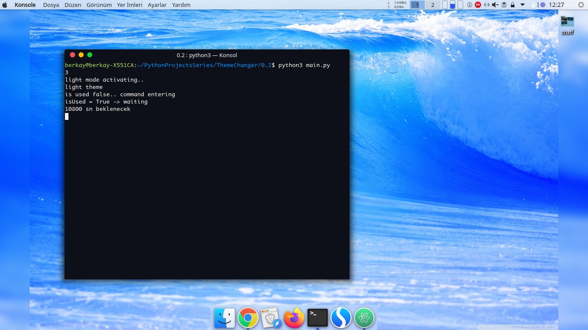
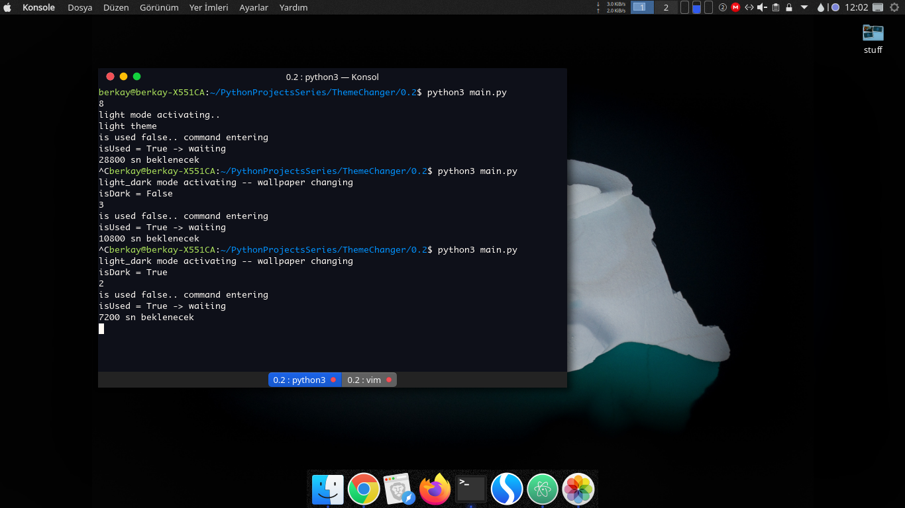
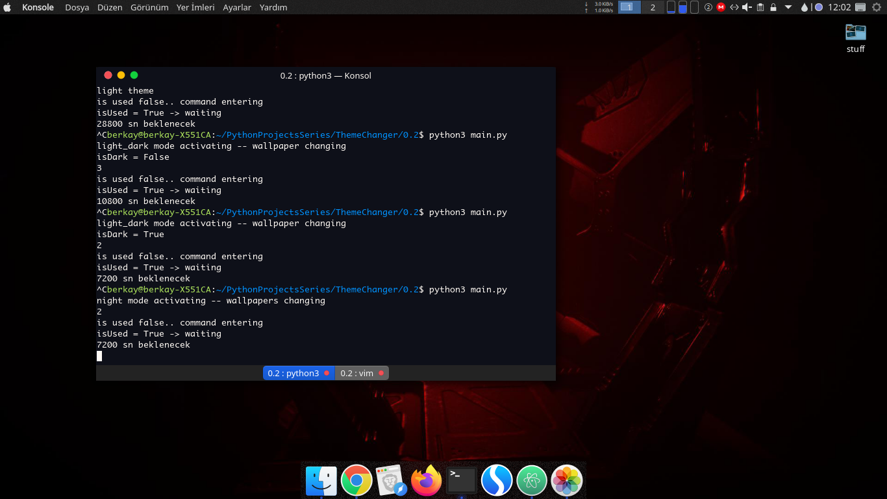

# KDynamic: An Alternative to MacOS Mojave Dynamic Theme and Wallpaper Changer for KDE Plasma 5

## Description

KDynamic is a multiple python script which makes whole system theme light or dark by specified hours

KDynamic uses native KDE Desktop Environment terminal commands so nothing unfamiliar

## Configuration

KDynamic need some paths;
- Where your favorite light plasma theme located
- Where your favorite dark plasma theme located
- Where your favorite wallpapers which categorized by you

to make your desktop like these

*light theme*



*light_dark isDark=False*


*light_dark isDark=True*



*night theme*




but don't worry setup.py will make this boring stuff for you

```sh
~/$ git clone https://github.com/ybgirgin3/KDynamic.git
~/$ cd KDynamic
~/$ python3 setup.py
```

## What you need to do for make program run ?

- First things first you need to pick up some wallpapers for each of theme maybe from somewhere you love

- Move images to the specified folders

- Make needed changes into the txt file


## ...And what to do for make program run at startup automatically ?

In KDE Plasma you need to go autostart directory

```sh
~/$ cd ~/.config/autostart
```

In this folder you need to move the file which named ***kdynamic.desktop*** and of course you need to change some values in it


After all things done you need to make 'main.py' file executable by;


```sh
~/$ sudo chmod +x main.py
```
command and when you restart your system program will run at startup


**This script created with python3**


**Script includes print functions so you can see what's going on while this little script running if you want**

for this run program manually;

```sh
~/$ python3 main.py
```
