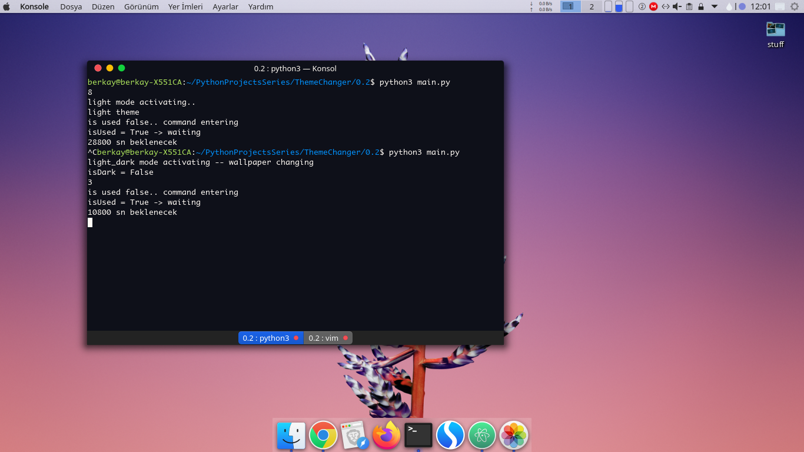

# KDynamic: An Alternative to MacOS Mojave Dynamic Theme and Wallpaper Changer for KDE Plasma 5

## Description

KDynamic is a multiple python script which makes whole system theme light or dark by specified hours using cron scheduler

KDynamic uses native K Desktop Environment (KDE) terminal commands so nothing unfamiliar

__update__
* v1.0: 
  - Breeze Theme Support Added (KDE)
* v1.1: 
  - Kvantum Theme Support Added (KDE)
* v2.0:
  - Gnome Support Added
  - More functional, smaller and less modules


## Configuration

KDynamic need some paths;
- Where your favorite light plasma theme located
- Where your favorite dark plasma theme located
- Where your favorite wallpapers which categorized by you

to make your desktop like these

*light theme*


*light_dark theme which is less eye hurting than light theme*



*night theme*


```sh
~/$ git clone https://github.com/ybgirgin3/KDynamic.git
~/$ cd KDynamic
~/$ python3 setup.py
```

during installation KDynamic will setup crontab for you<br>
after setup done you need to move your favorite wallpapers to the *~/KDynamic/pics* folder<br>
anddd... enjoyy


